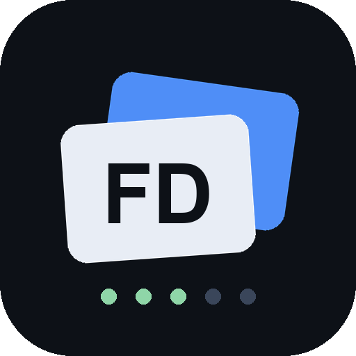

<p align="center">
  
</p>

<h1 align="center">Flash Deck</h1>

<p align="center"><b>Your Echo Show is now a study machine.</b><br>
Flashcards with pictures &amp; animations · spaced repetition · phone editing · voice post-its</p>

<p align="center">
  <a href="https://github.com/AssiamahS/flashdeck/releases/latest"></a>
  <a href="LICENSE"></a>
  
</p>

<p align="center">
  <a href="https://assiamahs.github.io/flashdeck/"><b>🌐 Website</b></a> ·
  <a href="https://assiamahs.github.io/flashdeck/editor.html"><b>📱 Deck Editor</b></a> ·
  <a href="https://github.com/AssiamahS/flashdeck/releases/latest"><b>⬇ Download</b></a> ·
  <a href="CHANGELOG.md"><b>📋 Changelog</b></a>
</p>

---

## What it does

Say **"Alexa, open flash deck"** — a home screen with your deck tiles, card counts, and
mastery stats appears. Study by voice or touch:

| Say | Does |
| --- | --- |
| "study exercise form" | starts a deck (or tap its tile) |
| "flip" (or tap the card) | reveal the answer |
| "got it" / "missed it" | grade + advance — missed cards return sooner (Leitner boxes 1–5) |
| "next" | skip without grading |
| "note pick up eggs" | saves a voice post-it to **My Notes** |
| "study my notes" | review your notes as flashcards |

**Cards can move.** A card can carry an image or a looping animation — watch the squat
while you name the muscles:

https://cdn.jsdelivr.net/gh/AssiamahS/flashdeck@main/media/squat.mp4

## Edit decks from your phone — no app install

Decks live in [`decks.json`](decks.json). The skill pulls it from this repo **at
runtime**, so an edit is live on your Echo Show in about a minute — no redeploy.

The [web editor](https://assiamahs.github.io/flashdeck/editor.html) (add to Home
Screen for the app feel) browses decks, adds/deletes cards, and creates decks. It
commits straight to this repo with a fine-grained GitHub token that never leaves your
device.

```json
{ "front": "France", "back": "Paris", "image": "https://flagcdn.com/w640/fr.png" }
{ "front": "Squat — primary muscles?", "back": "Quads, glutes, hamstrings", "video": "https://cdn.jsdelivr.net/gh/AssiamahS/flashdeck@main/media/squat.mp4" }
```

- `image` — any public HTTPS JPG/PNG
- `video` — public HTTPS MP4, loops muted on the card. **GIFs must be converted**
  (APL renders GIFs as a static frame): `tools/gif2mp4.sh <gif-url> media/name.mp4`,
  commit, use the jsDelivr URL.

## Run your own

1. Free [Amazon Developer account](https://developer.amazon.com) on the **same
   Amazon account as your Echo Show** (dev skills auto-appear on your devices).
2. `npm i -g ask-cli && ask configure`
3. `ask new` → Alexa-hosted (free Lambda + S3), then copy `lambda/`,
   `skill-package/` in and `git push` — push-to-deploy.
4. Fork this repo, point `REMOTE_DECKS_URL` in `lambda/index.js` and the constants
   in `docs/editor.html` at your fork.

## Architecture

```
skill-package/            manifest + interaction model (invocation: "flash deck")
lambda/index.js           all skill logic; fetches decks.json from GitHub at runtime
lambda/apl/               Echo Show screens: home grid + tap-to-flip card
decks.json                THE live deck source — what the phone editor edits
lambda/decks/*.json       bundled fallback decks (offline / first boot)
docs/                     website + phone editor + privacy (GitHub Pages)
media/                    card videos + icons, served via jsDelivr
tools/gif2mp4.sh          GIF → APL-safe looping mp4
```

## Roadmap

- [ ] Streaks + daily goal ("you're on a 6-day streak")
- [ ] AI answer grading — say the answer out loud, an LLM judges it
- [ ] Quizlet TSV import in the editor (paste an exported set → deck)
- [ ] AI deck generation ("make me 20 cards on the amendments")
- [ ] Echo Show 15 widget — persistent fridge notes board
- [ ] Shareable community decks

## License

[MIT](LICENSE)
